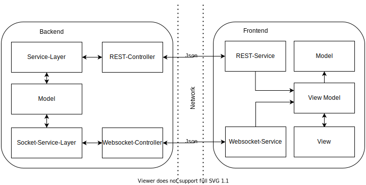
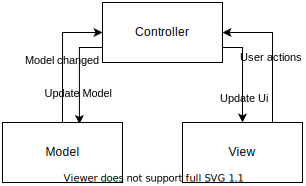
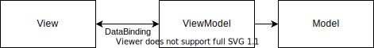
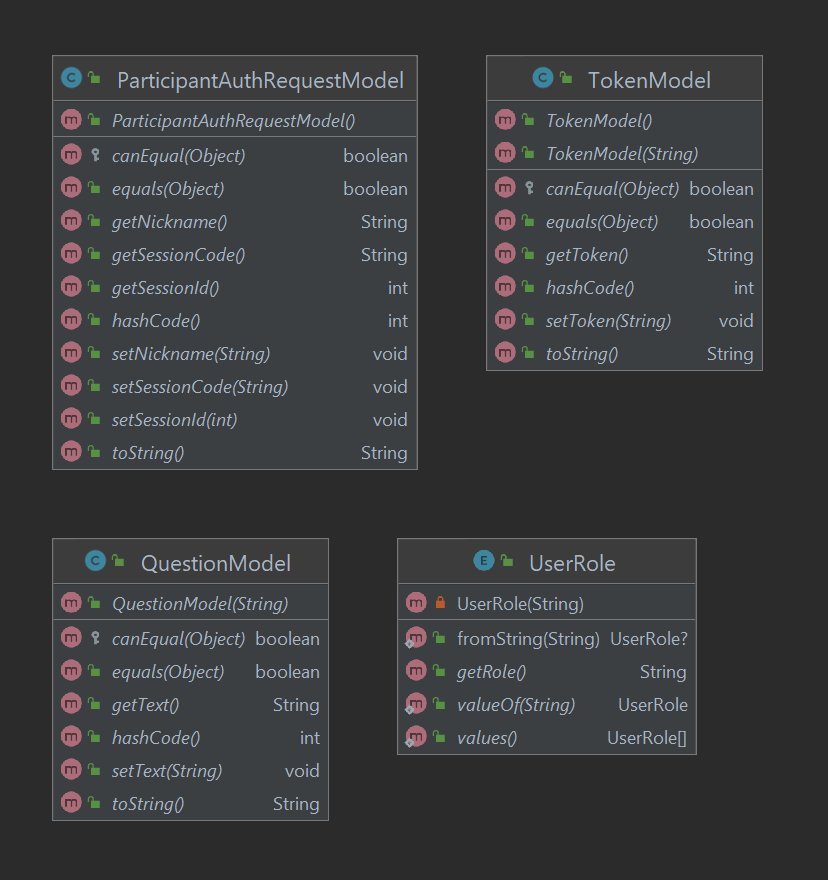
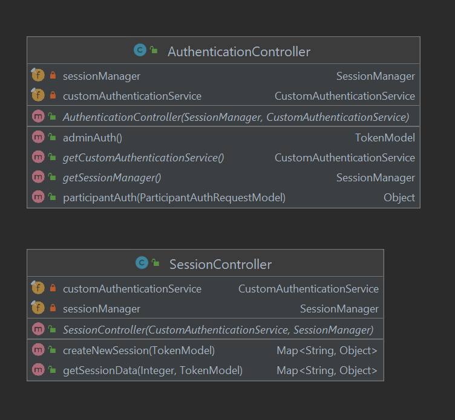
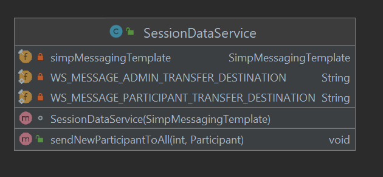
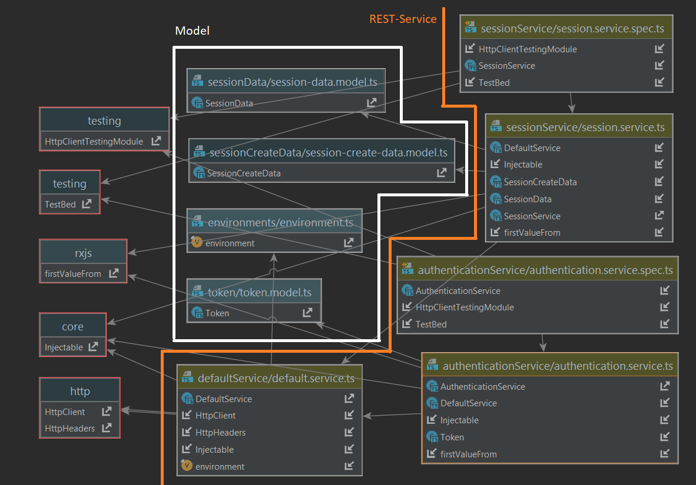
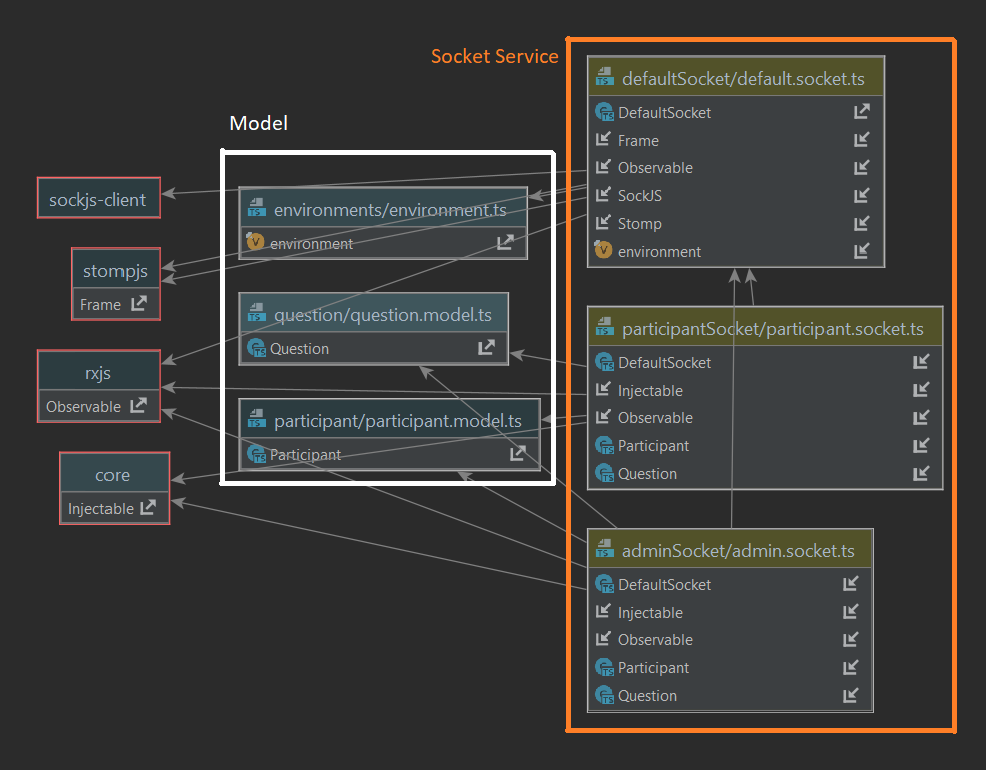

## Architectural Representation
This project uses the Model View ViewModel (MVVM) Pattern for the front end (Angular App) and the Model View Controller (MVC) Pattern for the back end (SpringBoot).

In MVC the model (data model, domain specific classes), the view (user interface) and the controller are separated. The Pattern can be seen in the next picture:

The front end internally follows the MVVM pattern which can be depicted as following.
This pattern separates the View components again into a funcional part (the ViewModel) and a purely representational part (View) while the model remains analogous to the back end.

The following diagrams display our architecture within the code structure.

UML diagram of backend model

UML diagram of backend REST-Controller

UML diagram of backend Socket-Controller

UML diagram of frontend REST-Service and model

UML diagram of frontend Websocket-Service and model

## Architectural Goals and Constraints

### MVC
As mentioned in chapter two frontend and backend are using the MVC pattern. This enables a clean software architecture with separate model view and controller.

### Front end
The Angular App-Client is written in TypeScript using the MVVM pattern. The Components form the view model, they are connected with the server via services (Web-/ Socket-Services).

MVVM:
* Model: domain specific classes modeled after backend classes
* View: html templates
* ViewModel: angular components

### Back end
The back end is also written in Java. As MVC tool we use Spring Boot. For the account system Spring security is used. We are planing to use a SQLight-Database.
The Server offers multiple REST APIs and Websocket-Connections which are accessed by our front end.
MVC:
* Model: domain specific classes
* View: no view available
* Controller: Rest-/ Websocket-Controller

Metrics

|LectureFeed Main Repository | LectureFeed Web Repository| LectureFeed Desktop Repository|
|--|--|--|
| |||
